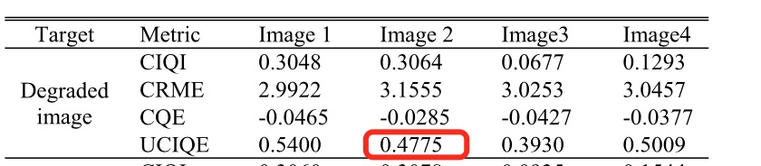

# Underwater image quality evalution methods
This is an implementation of UCIQE by python3.7. The original paper by Yang, Miao, and Arcot Sowmya can be found [here](https://ieeexplore.ieee.org/abstract/document/7300447).

# Requirements
You will need python3 as well as all the packages in the requirements.txt file.
```
pip3 install -r requirements.txt
```
# verification(906_img_.jpg for example)
## UCIQE on paper

## UCIQE computed 


